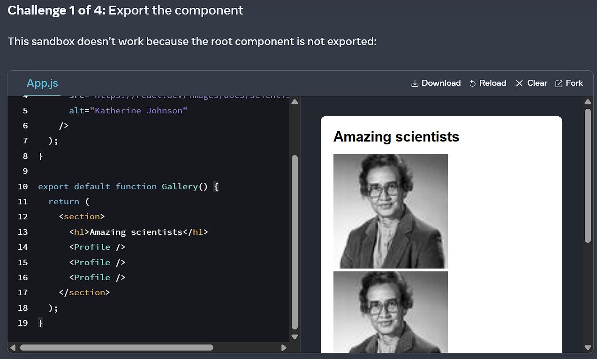
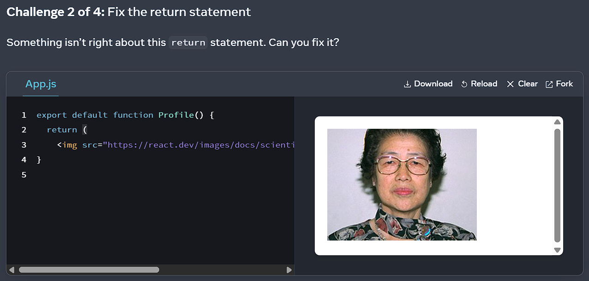
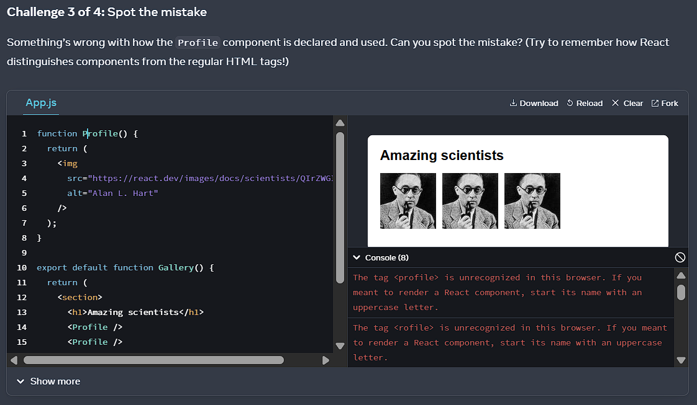
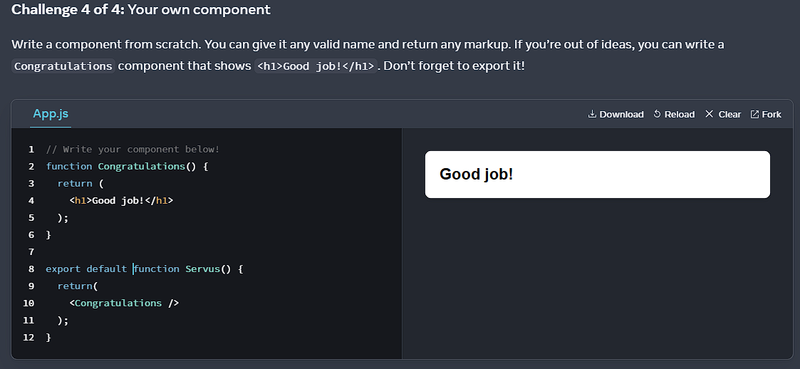

# Dokumentation der Challenges auf der Webseite react.dev
## Your First Component
### Challenge 1

Das Problem war, dass die `export` function fehlte.
### Challenge 2

Das Problem war, dass die Klammer beim `return` fehlte. 
### Challenge 3

Das Problem war, dass `profile` klein geschrieben war, statt groß (`Profile`).
### Challenge 4

## 