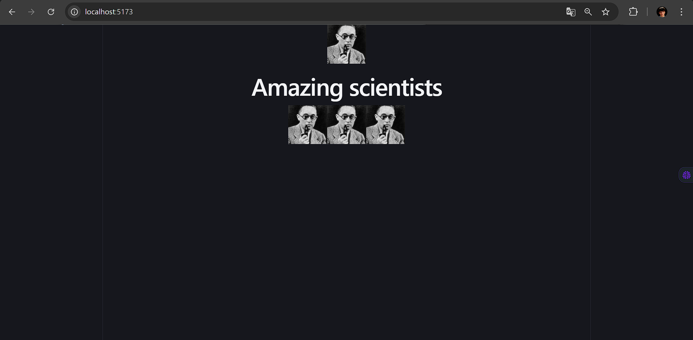
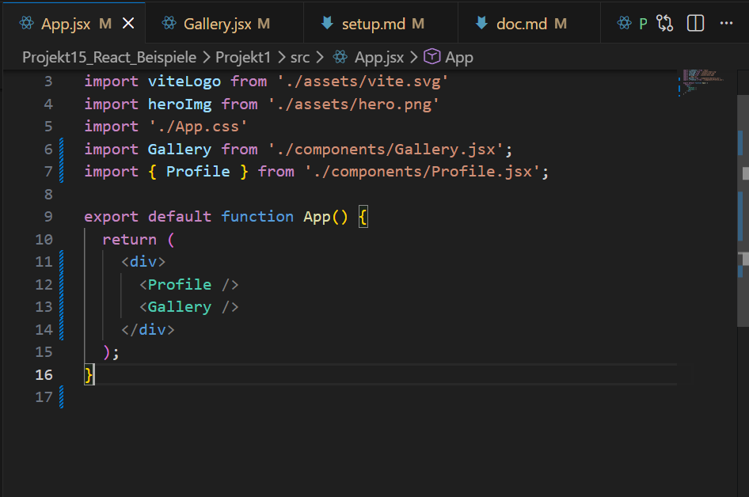
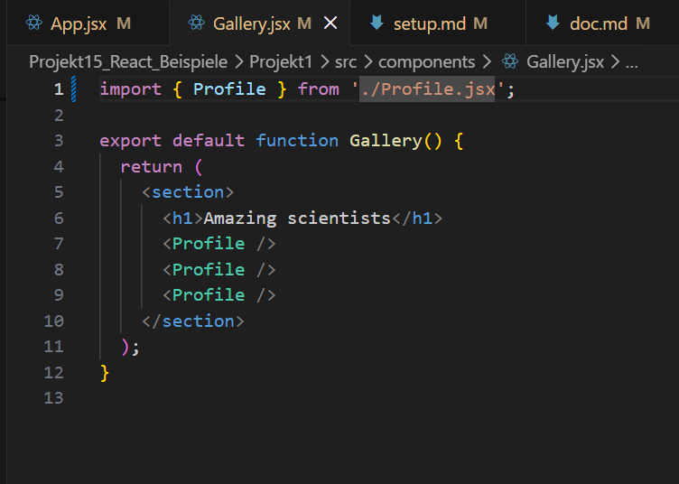
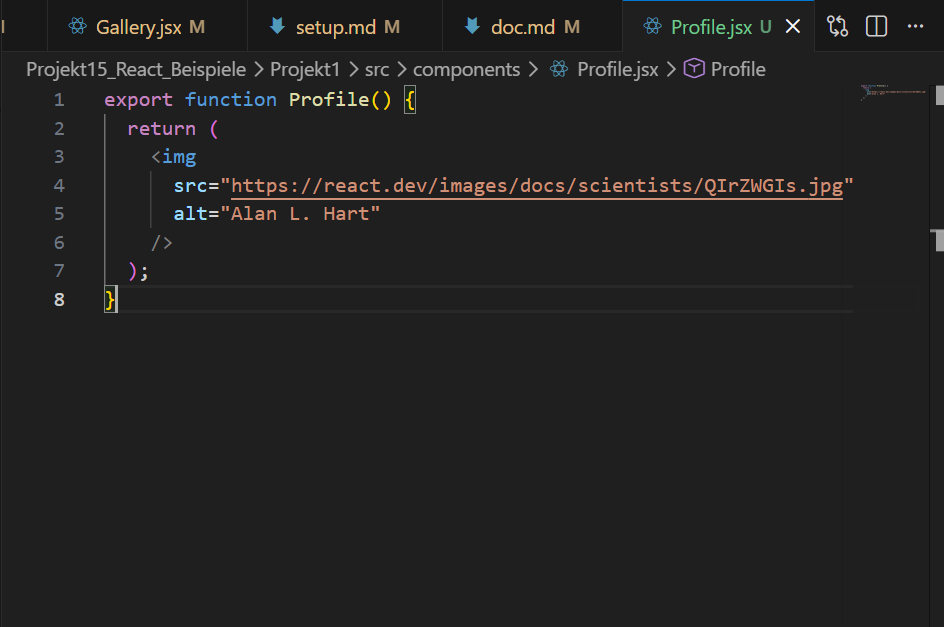
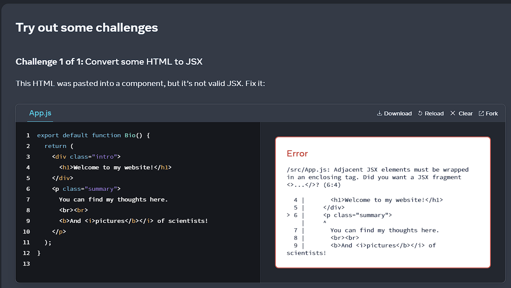
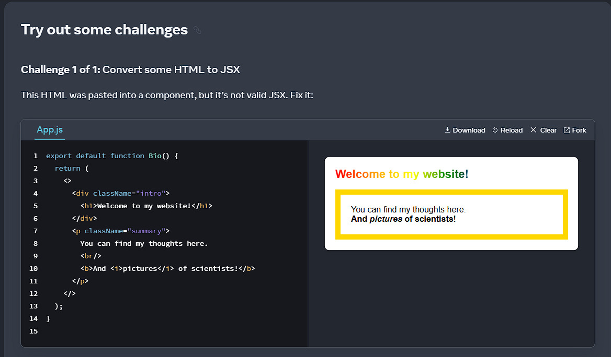
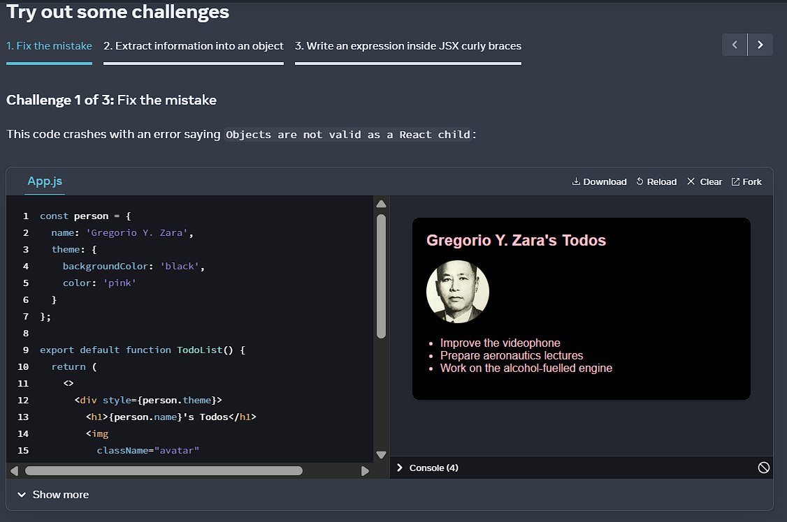
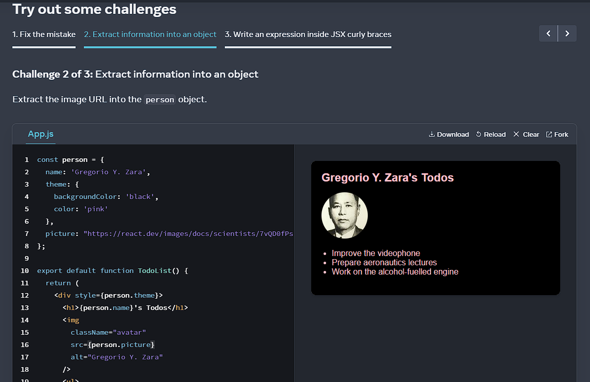
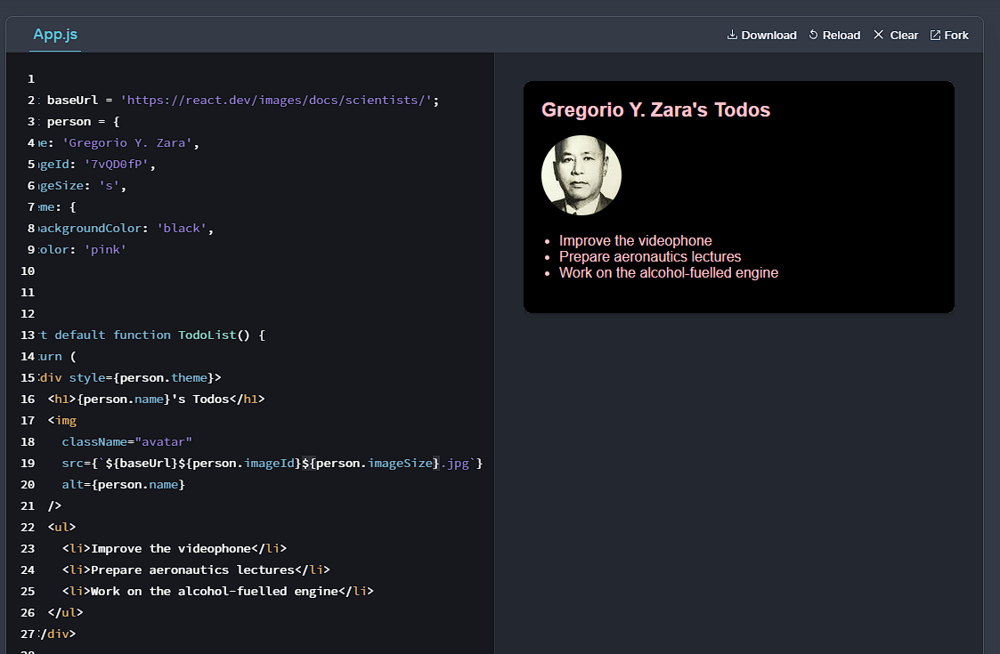

# Dokumentation der Challenges auf der Webseite react.dev
## Your First Component
### Challenge 1

Das Problem war, dass die `export` function fehlte.
### Challenge 2

Das Problem war, dass die Klammer beim `return` fehlte. 
### Challenge 3

Das Problem war, dass `profile` klein geschrieben war, statt groß (`Profile`).
### Challenge 4

## Importing and Exporting Components
### Challenge 1

## Writing Markup with JSX
### Challenge 1
#### Angabe

#### Lösung

## JavaScript in JSX with Curly Braces
### Challenge 1

### Challenge 2

### Challenge 3

Wichtig: verwenden von einer "großen" Klammer, die um alles gesammelt geht. Dazu noch gleich danach die Backticks um alles herum und das Dollar-Zeichen *$* um die Variable einzufügen.