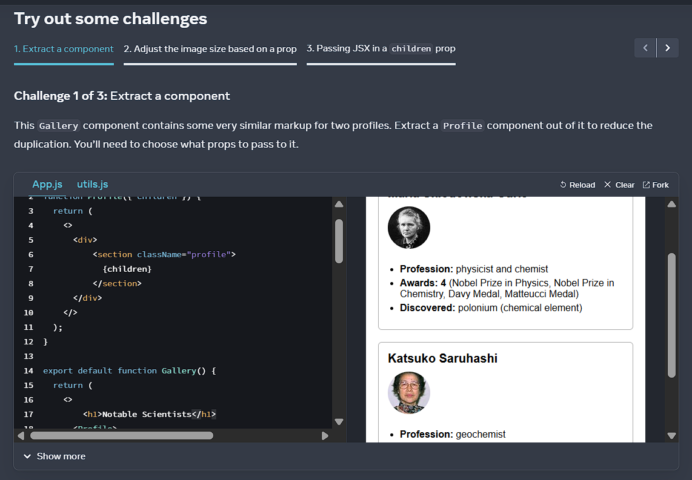
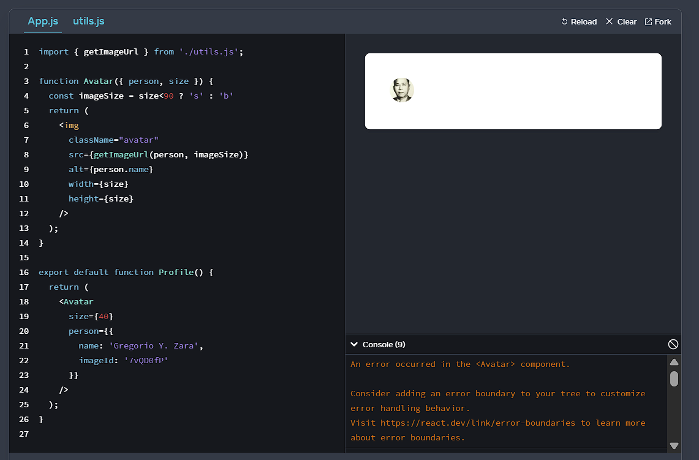
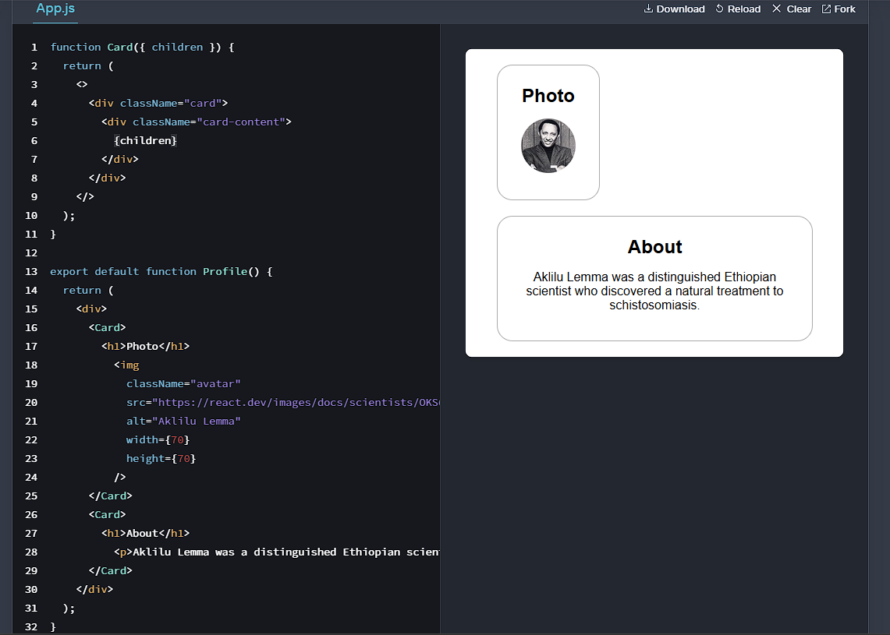
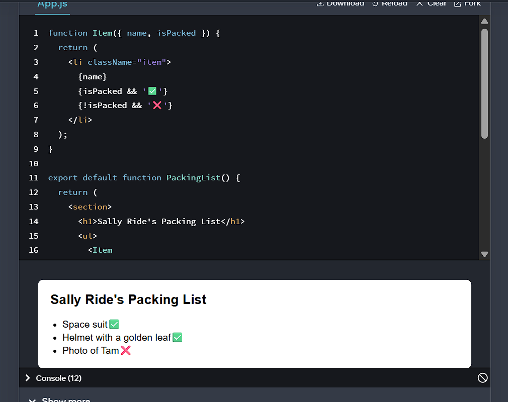
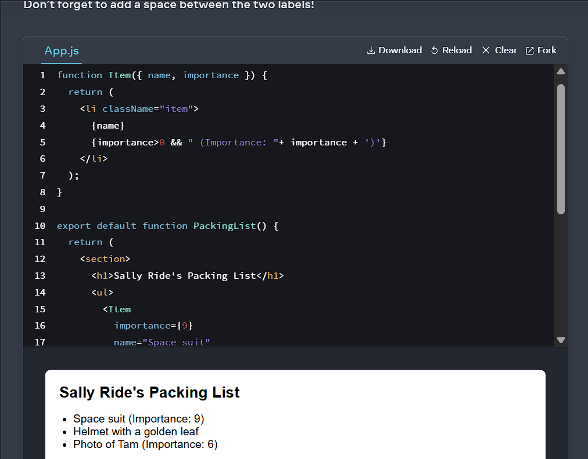
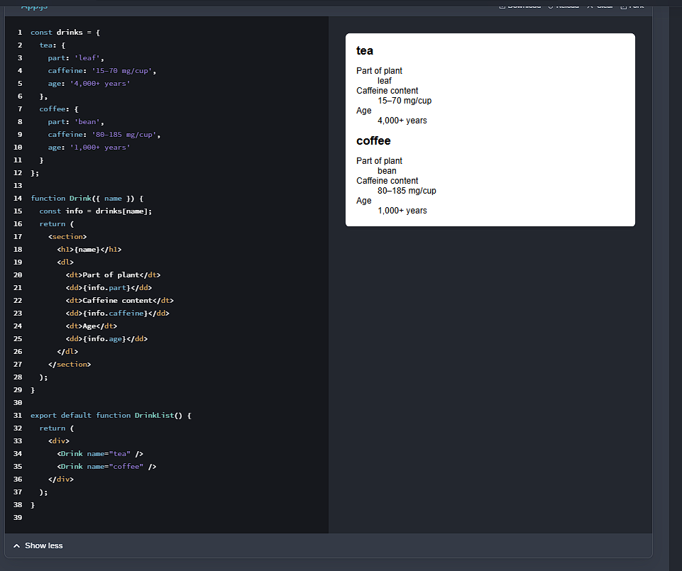
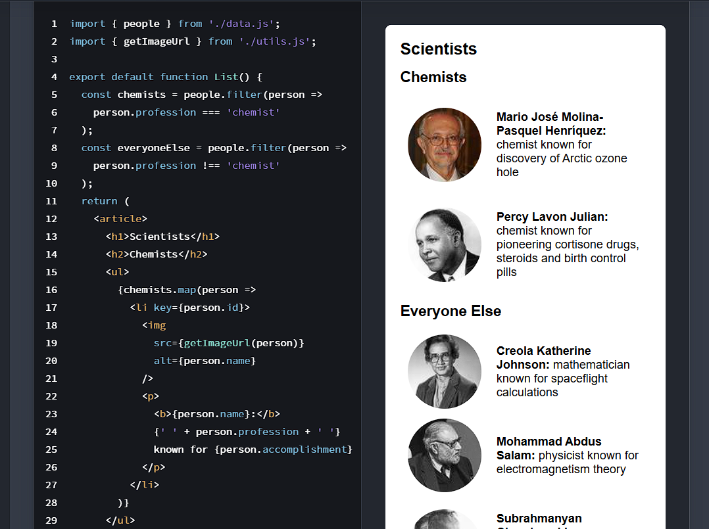
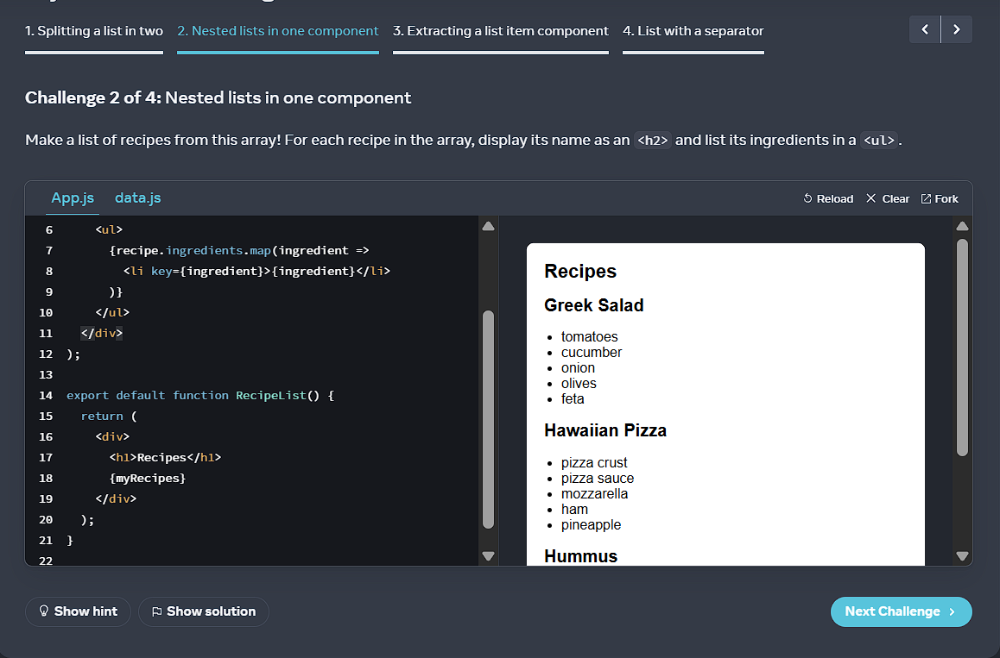
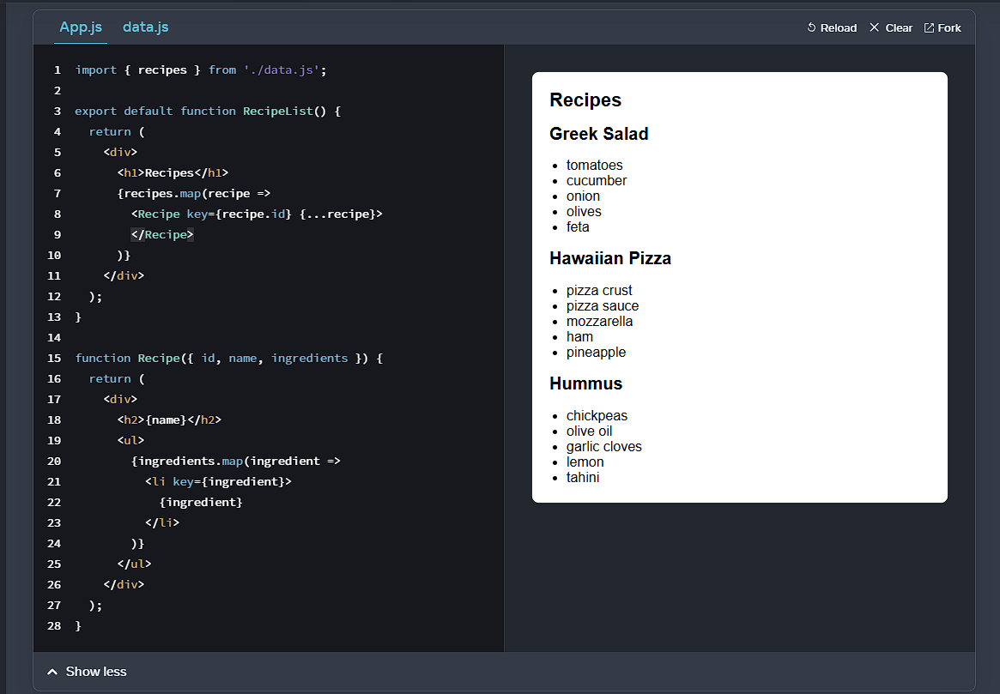
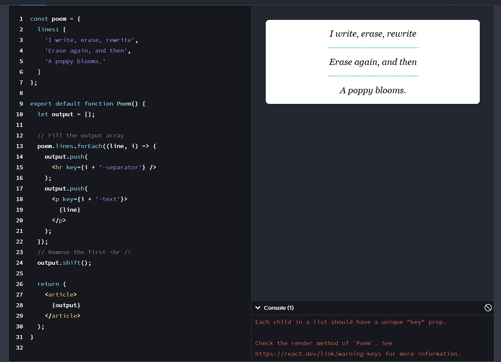

# Dokumentation der Challenges auf der Webseite react.dev
## Passing Props to a Component
### Challenge 1

Das Problem waren Codeduplikate.
### Challenge 2

Das Problem war die fehlende Konstante mit dem if-ternary Operator.
### Challenge 3

## Conditional Rendering
### Challenge 1

### Challenge 2

### Challenge 3

## Rendering Lists
### Challenge 1

### Challenge 2

### Challenge 3

### Challenge 4
