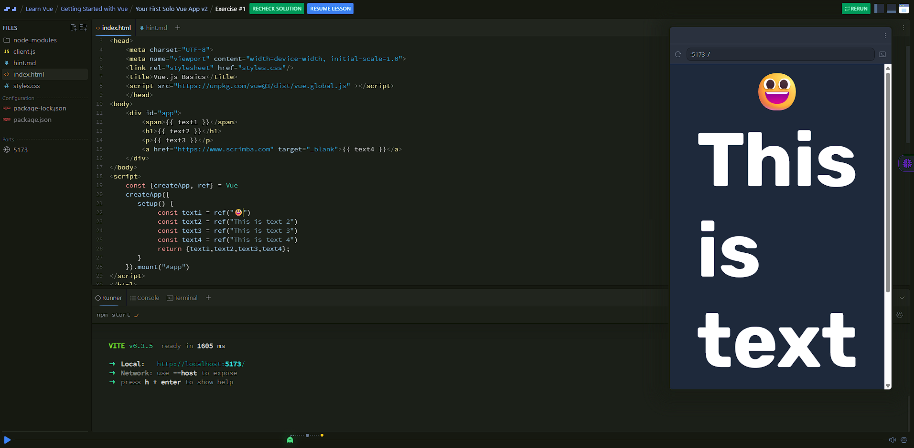
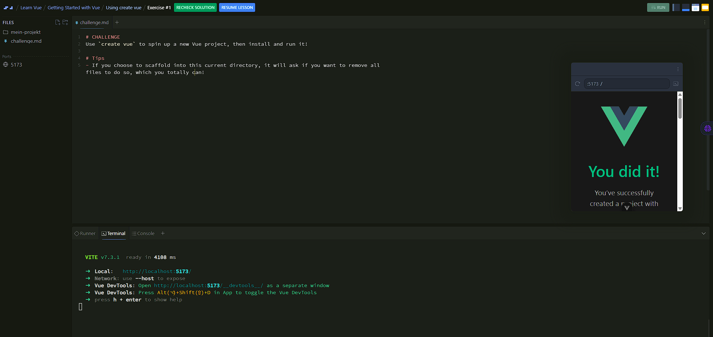

# Mitschrift zum Tutorial

## Video 1: Was ist Vue und um was geht es in diesem Tutorial?
Allgemeine Infos wurden gegeben. HTML, CSS und JavaScript werden vorausgesetzt. Es wird mit Vue 3 gearbeitet, da es die neueste Version ist und viele Verbesserungen bietet.

## Video 2: Warum sollte man Vue lernen?

### Kurzbeschreibung
- Vue ist ein **progressives Framework**.

### Popularität und Community (2024)
Quelle: Stack Overflow Survey und State of JS

- viert-beliebtestes Frontend-JavaScript-Framework
- 60,2 % Admiration Rating
- Platz 2 bei Nutzung, Bekanntheit und positiver Wahrnehmung
- Platz 3 bei Interesse und Retention

### GitHub-Statistiken
- 208.000 Stars
- 33.700 Forks

### Unternehmen, die Vue nutzen
- Adobe
- Nintendo
- Alibaba
- Zoom
- GitLab
- Grammarly
- Netlify
- Trustpilot
- und viele weitere

### npm-Downloads
- 5 bis 6 Millionen Downloads pro Woche

## Video 3: Erste Vue App erstellen
### Aufbau des Tutorials
Das Video bzw. Audio läuft im Hintergrund, links ist der Code und die Ordnerstruktur und rechts sieht man den Browser mit der laufenden App.
### Videoinhalte
Es wird mit CDN das vue.js-Skript eingebunden.
Funktionsweise von vue: Es hängt sich an ein HTML-Element (hier: `#app`) und steuert dessen Inhalt. Wichtig sind die doppelten geschweiften Klammern `{{}}`, die als Platzhalter für Daten dienen.

**Konzepte:**

In HTML: 
- Im Head wird das Vue.js-Skript eingebunden.
- Im Body wird ein div mit der ID `app` erstellt, das als Mounting Point dient.
- Statt `world`, wird `{{name}}` geschrieben.

In JavaScript: 
- Mit `const {createApp, ref} = Vue` wird die createApp-Funktion und die ref-Funktion aus dem Vue-Objekt extrahiert. `createApp` wird verwendet, um eine neue Vue-Anwendung zu erstellen, und `ref` wird verwendet, um reaktive Daten zu erstellen.
- `createApp({ ... }).mount('#app')` erstellt eine neue Vue-Anwendung mit den angegebenen Optionen und mountet sie an das HTML-Element mit der ID `app`. Als Inhalt wird setup() aufgerufen und die const name die wir in HTML brauchen, definiert und dann zurückgegeben.

Ich erweiterte das Testskript um eine weitere Variable `test` und gab ihr den Wert "servus". Es funktionierte.

## Video 4: Erste Vue App erstellen V2
Man bekommt eine Aufgabe gestellt, wo man die 404-Page mit Vue verändern soll, sodass man alle 4 Tags hat.
Die Aufgabenstellung wird als HTML-Kommentar eingefügt. Wenn das zu schwer ist, bekommt man noch eine `hint.md` zur Verfügung gestellt, die die exakte Syntax enthält.

Ich machte es ohne hint in folgendem Ablauf: 
- Vue CDN integrieren
- div mit id app erstellen
- neuen script Teil unterhalb des divs erstellen und alles importieren
- createApp erstellen und mounten
- ref variablen erstellen und zurückgeben
- Platzhalter in HTML einfügen

**Fehler:** Anführungszeichen bei der ID in HTML und JS vergessen und keinen neuen Emoji in span eingefügt.

**Folgendes fiel mir auf:** der Cursor im interaktiven Editor passt gar nicht mit meinem Mauszeiger überein, was die Übersicht erschwert. Mit der Zeit ging es komischerweise immer besser, weil ich draufkam, dass ich trotzdem dort bin, wo ich will, wenn ich dort hinklicke.

## Video 5: Vue lokal installieren

Bisher haben wir Vue über ein CDN eingebunden, was für kleine Projekte oder zum Lernen ausreichend ist. Für größere Projekte empfiehlt es sich jedoch, Vue lokal zu installieren, um mehr Kontrolle über die Entwicklungsumgebung zu haben und zusätzliche Tools nutzen zu können.

Ablauf auf der Kommandozeile:
- `npm create vue@latest` - Erstellt ein neues Vue-Projekt mit dem neuesten Vue-CLI.
- `y` - Bestätigt die Auswahl der Standardeinstellungen für das Projekt.
- Projektnamen festlegen
- Package name festlegen
- Packages und Tools auswählen (z.B. TypeScript, Router, Pinia, ESLint, Prettier)
- Experimentelle Features auswählen (z.B. Vue DevTools, Auto Import, Vue Router, Pinia, ESLint, Prettier)
- `cd projektname` - Wechselt in das neu erstellte Projektverzeichnis.
- `npm install` - Installiert die benötigten Abhängigkeiten für das Projekt.
- `npm run dev` - Startet den Entwicklungsserver und öffnet die Anwendung im Browser

Optional:
- `git init && git add -A && git commit -m "Initial commit"` - Initialisiert ein neues Git-Repository, fügt alle Dateien hinzu und erstellt den ersten Commit.

## Video 6: Verwenden von `create vue`

Genau diese Befehle musste ich jetzt selbst im Terminal eingeben, um ein neues Vue-Projekt zu erstellen. Es gab einige Fragen, die ich mit den Standardeinstellungen beantwortet habe. Am Ende konnte ich das Projekt erfolgreich starten und im Browser öffnen.

Der einzige Unterschied zum Tutorial war nur, dass eine separate Eingabe für die TypeScript-Option kam. 

## Video 7: Anatomie eines Vue-Projekts

Es gibt einen `src`-Ordner, in dem sich die Hauptdateien befinden:
- `main.js` - Hier wird die Vue-App erstellt und gemountet.
- `App.vue` - Die Hauptkomponente der Anwendung, die als Einstiegspunkt dient.
- `components` - Ein Ordner, in dem weitere Vue-Komponenten erstellt werden können.
- `assets` - Ein Ordner für statische Dateien wie Bilder, CSS, etc.

Auf der gleichen Ebene wie `src` gibt es weitere wichtige Dateien:
- `index.html` - Die Haupt-HTML-Datei, die als Vorlage für die Anwendung dient.
    - Wichtig: Hier wird das `div` mit der ID `app` definiert, an das die Vue-App gemountet wird. Darunter wird auch die `main.js` eingebunden, die die Vue-App erstellt und startet.
- `public/favicon.ico` - Das Favicon für die Anwendung.
- `jsconfig.json` - Konfigurationsdatei für zu kompilierende JavaScript-Dateien.
- `package.json` & `package-lock.json` - Enthält Informationen über das Projekt und die Abhängigkeiten.
- `vite.config.js` - Konfigurationsdatei für Vite, den Build-Tool, der in Vue-Projekten verwendet wird.
    Wichtig für später: `alias`

## Video 8: Zusammenfassung / Rückblick von Section 1
In diesem Abschnitt haben wir die Grundlagen von Vue kennengelernt, einschließlich der Erstellung einer einfachen Vue-App und der lokalen Installation von Vue. Wir haben auch die Struktur eines typischen Vue-Projekts untersucht und die wichtigsten Dateien und Ordner besprochen. In den nächsten Abschnitten werden wir tiefer in die Entwicklung mit Vue eintauchen und weitere Funktionen und Konzepte kennenlernen.

## Video 9: Scrimbassador werden
Scrimbassador zu werden bedeutet, ein aktives Mitglied der Scrimba-Community zu sein, das anderen Lernenden hilft und die Plattform unterstützt. Es gibt verschiedene Möglichkeiten, Scrimbassador zu werden, wie zum Beispiel durch das Erstellen von Inhalten, das Beantworten von Fragen in der Community oder das Teilen von Erfahrungen auf Social Media. Scrimbassadors erhalten besondere Vorteile (30% revenue share, Free Pro Membership, Swag, Exclusive channel, Badges, Early access) und Anerkennung für ihre Beiträge zur Community.